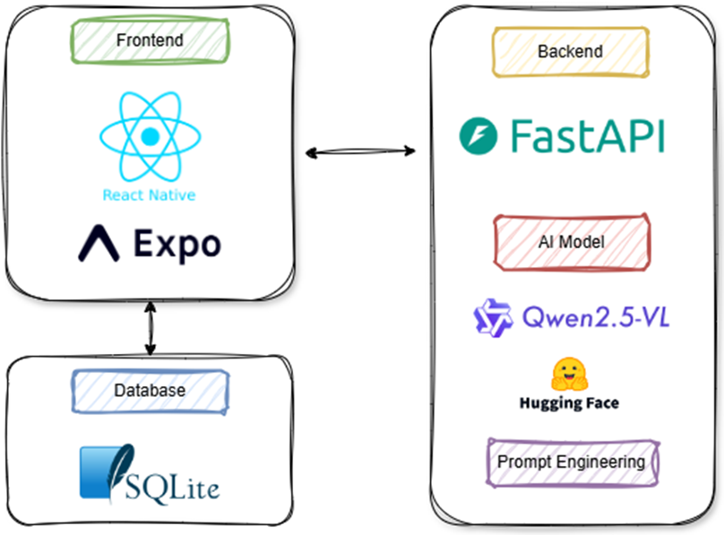
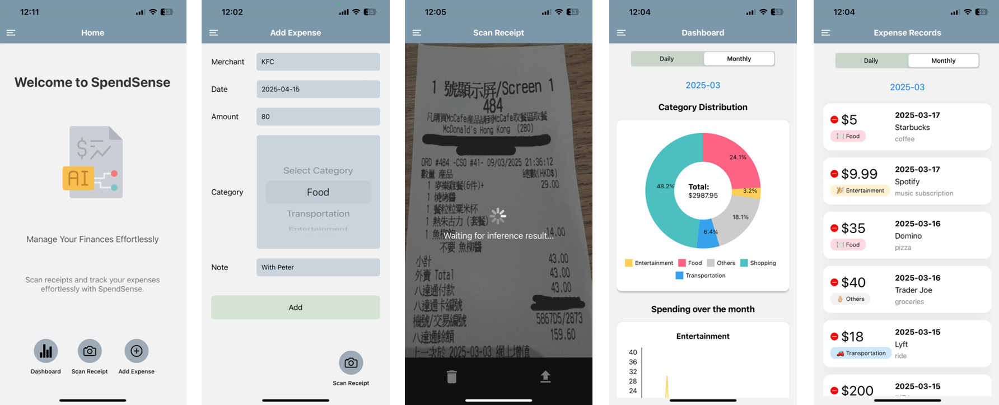

# Welcome to SpendSense

SpendSense is an expense tracking mobile application developed to enhance personal financial management with advanced vision language model for receipt scanning.

<div align="center">
  
</div>


## Demo Video

[](https://www.youtube.com/watch?v=5RDB1elqclk)

## Features

<div style="text-align: center;">
  
</div>

- AI Recipt scanning by taking picture or pick from photos
- Adding expense records from scanning receipt or manual input
- Dashboard for spending pattern visualization and analysis
- Detail Daily and monthly expenses records 

## Quick Start

### Starting the frontend

1. Install dependencies

   ```
   npm install
   ```
2. Modify the env.js for the Recipt scanning service api

   ```
   export const API_URL = http://HOST:8085/api/v1/inference
   ```

3. Start the app

   ```
   npx expo start
   ```
   or
   ```
   npx expo start --tunnel
   ```

4. Connect to the app by scanning the QR code above with Expo Go (Android) or the Camera app (iOS)

### Starting AI Receipt scanning service

1. Create virtual environment

```
conda create -n vlm_model python=3.9
conda activate vlm_model
pip install -r requirment.py
```

2. Modify the backend service host and port in the .env file 
```
MODEL_BACKEND_HOST = "0.0.0.0"
MODEL_BACKEND_PORT = "8085"
```

3. Start the server
```
python main.py
```
Now the api is serving at 'http://HOST:8085/api/v1/inference'


## Sample receipt for inference

<div align = "center">
  
</div>

- ### Sending inference request to server
```
def test_qwen_re(image_path):
    base64_image = encode_image2base64(image_path)

    response = requests.post(
        "http://localhost:8085/api/v1/inference", json={"base64_string": base64_image}
    )
    print(response)

    return response

if __name__ == "__main__":
    receipt_result = test_qwen_re("sample_image.jpeg")
    print(receipt_result)
```

- ### Response data

Result will be extracted in below format
```
{
    'Merchant': 'PARKnSHOP (HK) Limited', 
    'Date': '06/03/25', 
    'Amount': '$10.50', 
    'Category': 'Shopping'
}
```
