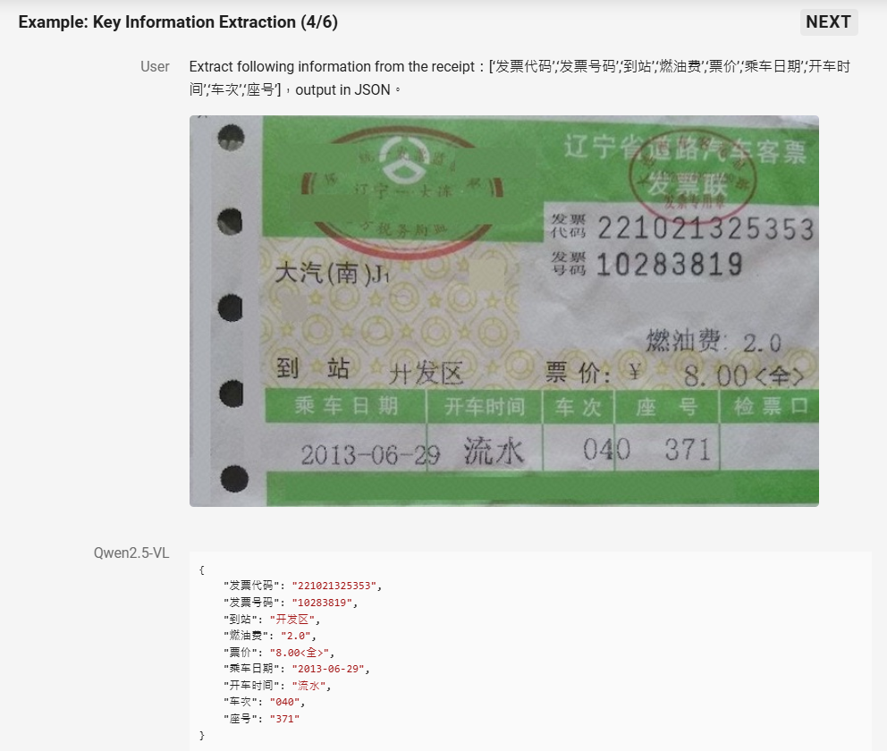

# AI Receipt scanning Server

## Environment

```
conda create -n vlm_model python=3.9
conda activate vlm_model
pip install -r requirment.py
```

## Start the Fastapi server

1. Modify the backend service host and port in the .env file

```
MODEL_BACKEND_HOST = "0.0.0.0"
MODEL_BACKEND_PORT = "8085"
```

2. Start the Fastapi server.

```
python main.py
```
Now the api is serving at 'http://HOST:8085/inference_re'.

## Sample receipt for inference

<div style="text-align: center;">
  
</div>

- ### Sending inference request to server
```
def test_qwen_re(image_path):
    base64_image = encode_image2base64(image_path)

    response = requests.post(
        "http://localhost:8085/inference_re", json={"base64_string": base64_image}
    )
    print(response)

    return response

if __name__ == "__main__":
    receipt_result = test_qwen_re("sample_image.jpeg")
    print(receipt_result)
```

- ### Response data

Result will be extracted in below format
```
{
    'Merchant': 'PARKnSHOP (HK) Limited', 
    'Date': '06/03/25', 
    'Amount': '$10.50', 
    'Category': 'Shopping'
}
```

## Model

Currently using Qwen-2.5-VL-7B model

### Configuration

- visual tokens per image
    
    Default range for the number of  in the model is 4-16384.
    You can set min_pixels and max_pixels according to your needs, such as a token range of 256-1280, to balance performance and cost.

    - min_pixels = 256 * 28 * 28
    - max_pixels = 1280 * 28 * 28

- Image size
    - resized_width = 1024
    - resized_height = 640

#### Context window

- max_position_embeddings = 128K


### Summary of performance

| Model     | Quantization   | VRAM Usage | Inference Time  (RTX 5880 Ada) | Accuracy|
|-----------|----------------|------------|----------------------------------|-------------------|
| **7B**    | 4-bit         | 7 GB       | ~5 s       |  Good
|           | 8-bit         | 10 GB      | ~15 s     |   Good
|           | No Quantization| 17 GB      | ~4 s      |  Best

## Official demonstration

https://qwenlm.github.io/blog/qwen2.5-vl/


